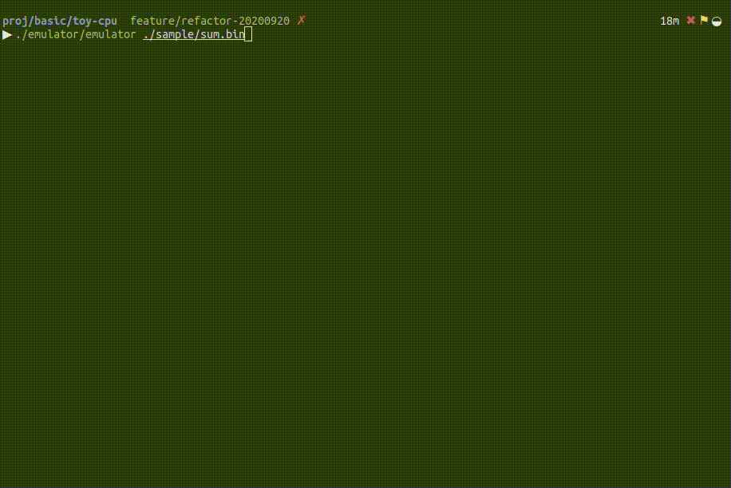

# toy-cpu

A toy cpu for learning basic cpu architecture.
This repository contains assembler, emulator and sample assembly code.



## Getting Started

```
cmake .
make

# assemble sum.s to sum binary
./assembler/assembler ./sample/sum.s ./sample/sum.bin

# emulate cpu with sum program
./emulator/emulator ./sample/sum.bin
```

## Architecture

### Basic Information

|||
|:---:|:---:|
|CPU bit|16bit|
|number of registers|8|
|name of psw register|r5|
|name of stack pointer register|r6|
|name of program counter register|r7|

### Instructions

| code         | description                                             |
|:------------:|:-------------------------------------------------------:|
| mov r0, r1   | copy register value (`r0 = r1`)                           |
| add r0, r1   | addition register value (`r0 = r0 + r1`)                  |
| sub r0, r1   | substruction register value (`r0 = r0 - r1`)              |
| and r0, r1   | and logical operation (`r0 = r0 & r1`)                    |
| or r0, r1    | or logical operation (`r0 = r0 | r1`)                   |
| sl r0        | 1bit shift operation (`r0 = r0 << 1`)                     |
| sr r0        | 1bit right operation (`r0 = r0 >> 1`)                     |
| ldl r0, 0x01 | set immediate value to lower 8bit in register           |
| ldh r0, 0x01 | set immediate value to higher 8bit in register          |
| cmp r0, r1   | substruction register value with changing PSW (`r1 - r2`) |
|je 0x01|jump to address (0x01) when zero flag is up in psw|
|jmp 0x01|jump to address (0x01) always|
|ld r0, 0x01|load memory in 0x01 address to r0 register|
|st r0, 0x01|store memory in 0x01 address from r0 register|
|hlt|stop cpu|

### Memory Layout Of Instruction

instruction using double register
```
15  14 13 12 11   10 9 8   7 6 5   4 3 2 1 0
-   inst           source   dest    ----
```

instruction using register and 8bit data
```
15  14 13 12 11   10 9 8   7 6 5 4 3 2 1 0
-   inst          source   data
```

instruction using single register
```
15  14 13 12 11   10 9 8   7 6 5 4 3 2 1 0
-   inst           reg     -----
```

instruction using single data
```
instruction using single data
15  14 13 12 11   10 9 8 7 6 5 4 3   2 1 0
-   inst           data              -----
```

### State Diagram

```
[FETCH_INST_0]  →  [FETCH_INST_1]  →  [FETCH_OPERAND_0]  → [FETCH_OPERAND_1]
↑                                       ↓ (withou ld, st)     ↓ (ld, st)
[WRITE_BACK]             ←             [             EXEC_INST             ]
```